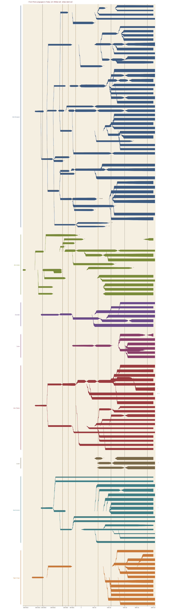
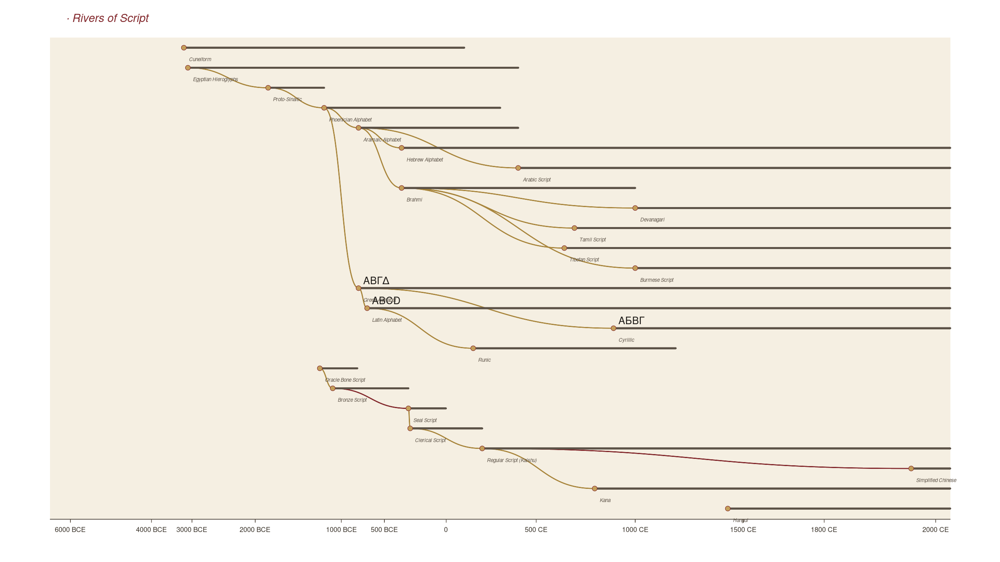

# Rivers of Language

> **An interactive visualization of how the world's 7 major language families evolved over 8000 years — Indo-European, Sino-Tibetan, Afro-Asiatic, Niger-Congo, Austronesian, Dravidian, Turkic — flowing like rivers from proto-languages to today.**
>
> **交互式可视化：印欧、汉藏、闪含、尼日刚果、南岛、达罗毗荼、突厥七大语系，8000 年演变如河流流淌。**

<p align="center">
  
</p>

<p align="center">
  <a href="https://rivers-of-language.vercel.app"><strong>🌊 Live Demo · 在线演示</strong></a>
  &nbsp;·&nbsp;
  <a href="#features">Features</a>
  &nbsp;·&nbsp;
  <a href="#data-sources">Data</a>
  &nbsp;·&nbsp;
  <a href="#run-locally">Run locally</a>
  &nbsp;·&nbsp;
  <a href="#citation">Cite</a>
</p>

<p align="center">
  <a href="https://nextjs.org/"></a>
  <a href="https://d3js.org/"></a>
  <a href="https://www.typescriptlang.org/"></a>
  <a href="LICENSE"></a>
</p>

---

**Rivers of Language** is an interactive web visualization of historical linguistics — a *language family tree* drawn as flowing rivers. From the **Proto-Indo-European** homeland in the Pontic steppe (~4500 BCE) to **Modern Mandarin** spoken by 1.1 billion today, every river tracks a language's lifespan, geographic spread, and changing speaker population. Branching shows how parent languages split into daughters (Latin → French, Spanish, Italian); dashed lines show **contact and borrowing** across families (Middle Chinese → Japanese, Korean, Vietnamese; Norman French → English).

Built as an open educational tool for linguists, etymology nerds, language learners, and anyone curious about **how languages evolve**.

---

## Features

- 🌳 **7 language families · 203 languages and dialects** — Indo-European, Sino-Tibetan, Afro-Asiatic, Niger-Congo, Austronesian, Dravidian, Turkic
- ⏳ **8000-year timeline** — from ~6000 BCE proto-languages to 2026 CE
- 📜 **Word evolution chains** — trace a single word across millennia:
  PIE \**ph₂tḗr* → Latin *pater* → Old French *pedre* → English *father* / French *père* / Spanish *padre*
- 🇨🇳 **Deep Chinese language tree** — Old Chinese → Middle Chinese → Modern Mandarin / Cantonese / Wu / Min Nan / Hakka / Gan / Xiang / Jin
- 🤝 **Cross-family contact & borrowing layer** — Sino-Xenic loans (Chinese → Japanese/Korean/Vietnamese), Arabic → Persian/Turkish/Swahili, Norman French → English, Sanskrit → SE Asian languages
- ✍️ **Script evolution mode** — toggle to see writing systems flow: Cuneiform → Phoenician alphabet → Greek → Latin / Cyrillic / Arabic / Brahmi; Oracle Bone Script → Bronze → Seal → Clerical → Modern Chinese
- 🗺️ **Mini-map + detail panel** — hover any river to see geography, peak speaker count, dates, and a representative word
- 📱 **Desktop + mobile responsive** — wide streamgraph on desktop, scrollable + bottom sheet on phones
- 🌗 **Bilingual** — every language labeled in both English and Chinese (中英双语)

## Demo

🌊 **[rivers-of-language.vercel.app](https://rivers-of-language.vercel.app)**

<p align="center">
  
</p>

## Why this exists

Most existing **language family tree** visualizations are static images (Wikipedia, textbook diagrams) or limited to a single family. The few interactive ones either lack scale (single branch) or fidelity (no etymology, no contact layer). This project aims to be the **most comprehensive interactive language phylogeny on the web**:

- **Quantitative**: each river's thickness is the estimated speaker population (log scale), so you can see English explode, Latin extinct, Tocharian vanish
- **Geographic**: a mini-map shows where each language was/is spoken
- **Etymological**: word chains let you watch one word travel through time
- **Cross-cultural**: borrowing arrows reveal contact between families (Chinese ↔ Japanese, Arabic ↔ European languages, Sanskrit ↔ Southeast Asia)

## How languages evolve

Languages change continuously through **sound shifts, grammatical drift, vocabulary borrowing, and population migration**. When a speech community splits — by mountain, sea, or empire — the daughter populations drift apart until their speech is no longer mutually intelligible. This is **language splitting**. The reverse is **language contact**, when speakers of different languages live alongside and trade words and structures.

Examples from this visualization:

- **The Indo-European hypothesis (1786, Sir William Jones)**: Sanskrit, Greek, Latin, Celtic, Germanic, and Slavic languages descended from a single unattested ancestor (Proto-Indo-European). This project traces all major branches.
- **Grimm's Law (~500 BCE)**: PIE *p, t, k → Germanic *f, þ, h. So Latin *pater* but English *father*.
- **The Sino-Xenic borrowings (6–9c CE)**: Japanese, Korean, and Vietnamese borrowed thousands of Chinese words during Tang Dynasty contact — 60–70% of Korean and Vietnamese vocabulary is Sino-derived even though their grammar is unrelated.
- **The Bantu Expansion (~3000 BCE – 500 CE)**: One of history's largest migrations, spreading Bantu languages from West Africa across half a continent.

## Indo-European evolution (highlight)

This visualization includes 80 Indo-European languages, from **Proto-Indo-European** (~4500 BCE, Pontic-Caspian steppe) through:

- **Anatolian** — Hittite, Luwian
- **Tocharian** — Tocharian A and B (Central Asia)
- **Indo-Iranian** — Vedic Sanskrit, Avestan, Old Persian → Hindi, Urdu, Bengali, Persian, Pashto, Kurdish
- **Greek** — Mycenaean → Classical → Koine → Modern Greek
- **Italic / Romance** — Latin → French, Italian, Spanish, Portuguese, Romanian
- **Celtic** — Gaulish, Old Irish → Irish, Welsh, Breton
- **Germanic** — Proto-Germanic → Gothic, Old Norse (Icelandic, Norwegian, Swedish, Danish), Old English → English, German, Dutch, Yiddish
- **Balto-Slavic** — Old Church Slavonic → Russian, Polish, Czech, Serbo-Croatian, Bulgarian; Lithuanian, Latvian
- **Albanian** and **Armenian**

## Sino-Tibetan / Chinese language family

Deep coverage of the **Sinitic branch**:

- **Old Chinese** (1200 BCE – 200 CE, oracle bone & Shijing era)
- **Middle Chinese** (200 – 1200 CE, *Qieyun* rhyme tables, basis of Sino-Xenic readings in Japan/Korea/Vietnam)
- **Early Mandarin** (1200 – 1700 CE)
- **Modern dialects**: Standard Mandarin 普通话, Cantonese 粤, Wu 吴, Southern Min 闽南, Hakka 客家, Gan 赣, Xiang 湘, Jin 晋

Plus the **Tibeto-Burman** branch (Tibetan, Burmese, Yi, Naxi, Karen, Qiang, Rgyalrong) and contact ghosts (Japanese, Korean, Vietnamese) to show Sinosphere influence.

## Etymology word chains

Each language has at least one **representative word** showing its sound across time. Try hovering on:

| Word | Path |
|---|---|
| *father* | PIE *\*ph₂tḗr* → Sanskrit *pitṛ́* → Greek *πατήρ* → Latin *pater* → French *père* / English *father* / German *Vater* |
| *mother* | PIE *\*méh₂tēr* → Sanskrit *mātṛ́* → Latin *māter* → Russian *мать* / Persian *مادر* |
| *seven* | PIE *\*septḿ̥* → Persian *haft* (s→h) / English *seven* / Spanish *siete* |
| *eye* | Proto-Austronesian *\*maCa* → Malay/Tagalog/Maori *mata* → Hawaiian *maka* (t→k shift) → Malagasy *maso* (t→s shift) |
| *father* (汉语) | Old Chinese *\*paʔ* (父) → Middle Chinese *bjuX* → Mandarin *fù* / Cantonese *fu6* / Min Nan *pē* (preserves OC \**p*) / Japanese *fu* (Sino-Japanese loan) |

## Data sources

| Source | Use | URL | License |
|---|---|---|---|
| **Glottolog 5.x** | Language family tree topology, glottocodes, coordinates | [glottolog.org](https://glottolog.org/) | CC BY 4.0 |
| **Wikidata** | Speaker counts (P1098), coordinates (P625), language IDs | [query.wikidata.org](https://query.wikidata.org/) | CC0 |
| **Wikipedia** | Historical timeline, narrative, branch hierarchies | [en.wikipedia.org](https://en.wikipedia.org/) | CC BY-SA 4.0 |
| **Wiktionary etymology** | Word evolution chains (PIE reconstructions, descendants) | [en.wiktionary.org](https://en.wiktionary.org/) | CC BY-SA 4.0 |
| **WALS Online** | Reference for typological features | [wals.info](https://wals.info/) | CC BY 4.0 |
| **Index Diachronica** | Sound change rule reference | [chridd.nfshost.com/diachronica](https://chridd.nfshost.com/diachronica/) | Public |

Curated 200 seed nodes are in `data/languages.*.json`. Auto-ingestion scripts are in `scripts/` (see `scripts/README.md`).

## Run locally

```bash
git clone https://github.com/huodebing-alt/rivers-of-language.git
cd rivers-of-language
npm install
npm run dev      # http://localhost:3000
```

### Build & deploy

```bash
npm run build           # static export to ./out
npx vercel --prod       # deploy to Vercel
```

The project uses Next.js 14 `output: 'export'` for fully static hosting — works on Vercel, Netlify, Cloudflare Pages, GitHub Pages.

### Expand the data

```bash
npm run ingest:glottolog    # fetch Glottolog tree
npm run ingest:wikidata     # fetch speaker counts via SPARQL
npm run ingest:wiktionary   # fetch word etymologies (lower hit rate)
npm run ingest:merge        # merge into data/languages.merged.json
```

## Tech stack

- **[Next.js 14](https://nextjs.org/)** — App Router, static export
- **[D3.js v7](https://d3js.org/)** — custom streamgraph paths with Bezier-curved branching
- **[TypeScript 5](https://www.typescriptlang.org/)** — strict mode
- **[Tailwind CSS](https://tailwindcss.com/)** — utility classes + custom palette
- Custom layout algorithm — phylogenetic streamgraph with log-scale speaker thickness
- Static SVG rendering — fast first paint, no canvas dependency

## Project structure

```
rivers-of-language/
├─ app/
│   ├─ layout.tsx                 # Root layout (fonts + meta)
│   ├─ page.tsx                   # Main page entry
│   ├─ globals.css                # Tailwind + custom CSS vars
│   └─ components/
│       ├─ App.tsx                # Top-level state + responsive shell
│       ├─ RiverChart.tsx         # D3 streamgraph (language mode)
│       ├─ ScriptTree.tsx         # Script evolution view
│       ├─ DetailPanel.tsx        # Selected-language sidebar
│       ├─ MiniMap.tsx            # World mini-map
│       └─ Controls.tsx           # Mode toggle + family filters
├─ lib/
│   ├─ types.ts                   # All TypeScript interfaces
│   ├─ data.ts                    # Data loading + edge derivation
│   └─ layout.ts                  # Phylogenetic streamgraph algorithm
├─ data/                          # 203-language curated seed (JSON)
│   ├─ languages.ie.json          (87 — Indo-European)
│   ├─ languages.st.json          (36 — Sino-Tibetan + contact ghosts)
│   ├─ languages.afro.json        (25 — Afro-Asiatic)
│   ├─ languages.an.json          (20 — Austronesian)
│   ├─ languages.other.json       (35 — Niger-Congo + Dravidian + Turkic)
│   ├─ contacts.json              # Cross-family borrowing edges
│   ├─ words.json                 # Etymology chains
│   └─ scripts.json               # Writing system evolution
├─ scripts/                       # Data ingestion (Glottolog / Wikidata / Wiktionary)
├─ preview/                       # Hero screenshots
└─ Phase2-技术与数据.md            # Full Chinese technical spec
```

## Contributing

PRs welcome! Particularly:

- **Add missing languages** — especially under-represented families (Native American, Papuan, Australian, Caucasian)
- **Fix dates / speaker counts** — historical linguistics estimates vary; cite your source
- **Add etymology chains** — see `data/words.json` format
- **Improve sound change notes** — Grimm's Law, Verner's Law, Great Vowel Shift, etc.
- **Translations** — UI strings ready for i18n

Open an issue first for major changes.

## Citation

If you use this in academic work:

```bibtex
@software{rivers_of_language_2026,
  author = {Huo, Debing},
  title  = {Rivers of Language: An Interactive 8000-Year Visualization
            of World Language Family Evolution},
  year   = {2026},
  url    = {https://github.com/huodebing-alt/rivers-of-language},
  note   = {Data sources: Glottolog, Wikidata, Wikipedia, Wiktionary}
}
```

## Acknowledgments

- The **Glottolog** team (Harald Hammarström, Sebastian Bank, Robert Forkel, Martin Haspelmath) for the canonical language tree
- **Wikipedia** and **Wiktionary** editors who maintain the world's largest open linguistic corpus
- The **Tower of Babel project** (Sergei Starostin) for inspiration
- **etymonline** (Douglas Harper) for entry-level etymology references
- **Robert Blust** for Proto-Austronesian reconstructions
- **William H. Baxter & Laurent Sagart** for Old Chinese reconstructions

## License

- Code: **MIT**
- Data: **CC BY-SA 4.0** (derivative of Glottolog / Wikipedia)

---

<p align="center">
  <strong>Built with 🌊 for everyone curious about how humans came to speak the way we do.</strong>
  <br>
  <em>语言之河 · Rivers of Language · 2026</em>
</p>
